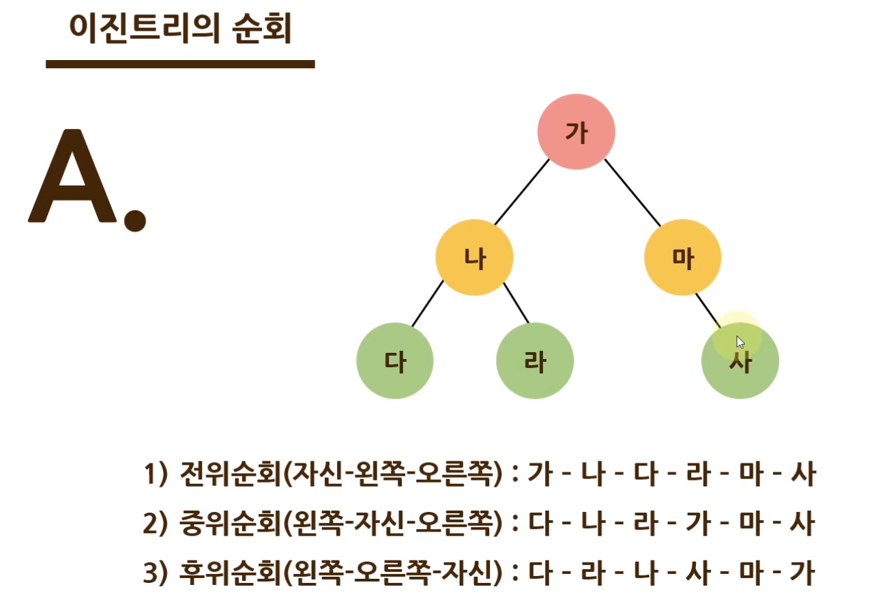

# 트리와 그래프

https://www.notion.so/a5a0fafe306e4cb78ec4476a272d156d?v=e116f6cdc6e34075bf8e4c0e56429a26

## 1. 트리

- 뿌리(Root Node), 가지(Edge), 잎(Leaf Node)로 구성
- **탐색** 을 위한 자료구조
- Node와 Edge(branch)를 이용하여 데이터를 표현

### 이진트리

자식노드가 **최대 두 개**인 노드들로 구성된 트리  

- 포화이진트리, 완전이진트리

#### 포화이진트리

모든 노드가 **두개의 자식노드**를 가지며 모든 잎 노드가 **동일한** 깊이레벨을 갖는다.

#### 완전이진트리

**마지막 레벨을 제외하고** 모든 레벨이 완전히 채워져 있으며, 마지막 레벨에서는 **왼쪽부터** 노드가 순서대로 채워져 있다.

### 이진트리의 순회

#### 전위순회

부모 노드 부터 자식 노드 까지 **아래 방향**으로 방문

1. 자신 노드
2. 왼쪽 노드
3. 오른쪽 노드

#### 중위순회

왼쪽 하위트리부터 오른쪽 하위트리 방향으로 방문

1. 왼쪽 노드
2. 자신 노드
3. 오른쪽 노드

#### 후위순회

자식노드를 모두 탐색하고 부모노드 방문

1. 왼쪽 노드
2. 오른쪽 노드
3. 자신 노드

#### 삽입

#### 탐색

#### 삭제

## 그래프

- 간선과 노드들 간의 관계 잘 파악할 것.
  ex) 서로의 집을 한번씩 방문하려면?
- **넓이 우선 탐색(BFS)** : 가까운 정점을 먼저 방문, 먼 정점은 나중에 방문!
- **깊이 우선 탐색(DFS)** : 현재 정점에서 한 방향으로 가면서 검사, 막힌 정점은 포기하고 마지막에 따라온 간선으로 되돌아감.

## 트리 탐색 방법

### 1. 깊이 우선 탐색(DFS) - FILO, Stack

방문한 곳을 []로 담아둠 (stack)

### 2. 넓이 우선 탐색(BFS) - FIFO, Queue
